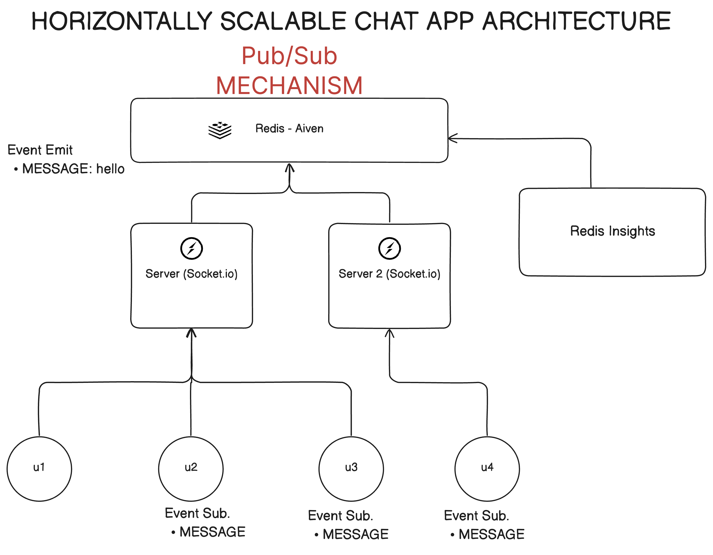

# Scalable Node.js Socket Chat Application

## 🏗️ Architecture
[](architecture.png)

### Pub/Sub Architecture with Redis/Valkey
This chat application uses a publish/subscribe (pub/sub) pattern with Redis/Valkey as the message broker. Here's how it works:

1. **Client-Side (Web Application)**:
   - Built with React and Socket.IO client
   - Connects to the server via WebSocket
   - Sends messages to the server
   - Receives broadcasted messages from all users

2. **Server-Side (Node.js)**:
   - Uses Socket.IO for real-time communication
   - Implements a pub/sub pattern with Redis/Valkey
   - Handles message broadcasting to all connected clients

3. **Message Flow**:
   ```
   Client A -> Server -> Redis Pub -> Redis Sub -> Server -> All Clients
   ```
   - When a user sends a message, it's published to a Redis channel
   - The server subscribes to this channel
   - When a message is received, it's broadcasted to all connected clients

4. **Redis/Valkey Cloud (Aiven)**:
   - Used as a message broker for pub/sub
   - Ensures reliable message delivery
   - Enables horizontal scaling of the application
   - Provides persistence and high availability

## 🚀 Getting Started

### Prerequisites
- Node.js (v14 or higher)
- Yarn package manager
- Redis/Valkey instance (we use Aiven Cloud)

### Installation

1. Clone the repository:
   ```bash
   git clone https://github.com/yourusername/scalable-nodejs-socket-chat-app.git
   cd scalable-nodejs-socket-chat-app
   ```

2. Install dependencies:
   ```bash
   yarn install
   ```

3. Set up environment variables:
   Create a `.env` file in the `apps/server` directory with the following variables:
   ```
   REDIS_HOST=your-redis-host
   REDIS_PORT=your-redis-port
   REDIS_USERNAME=your-redis-username
   REDIS_PASSWORD=your-redis-password
   ```

4. Start the development servers:
   ```bash
   # Start the server
   cd apps/server
   yarn dev

   # In a new terminal, start the web client
   cd apps/web
   yarn dev
   ```

5. Open your browser and navigate to `http://localhost:3000`

## 🛠️ Tech Stack

- **Frontend**:
  - React
  - Socket.IO Client
  - TypeScript
  - CSS Modules

- **Backend**:
  - Node.js
  - Socket.IO Server
  - TypeScript
  - Redis/Valkey (Aiven Cloud)

## 📦 Project Structure

```
scalable-nodejs-socket-chat-app/
├── apps/
│   ├── web/                 # React frontend
│   │   ├── app/
│   │   │   ├── context/     # Socket context
│   │   │   └── page.tsx     # Main chat page
│   │   └── package.json
│   └── server/              # Node.js backend
│       ├── src/
│       │   ├── services/    # Socket service
│       │   └── index.ts     # Server entry
│       └── package.json
└── package.json
```

## 🔧 Environment Variables

The following environment variables are required for the server:

| Variable | Description |
|----------|-------------|
| REDIS_HOST | Redis/Valkey host URL |
| REDIS_PORT | Redis/Valkey port number |
| REDIS_USERNAME | Redis/Valkey username |
| REDIS_PASSWORD | Redis/Valkey password |

## 🤝 Contributing

1. Fork the repository
2. Create your feature branch (`git checkout -b feature/amazing-feature`)
3. Commit your changes (`git commit -m 'Add some amazing feature'`)
4. Push to the branch (`git push origin feature/amazing-feature`)
5. Open a Pull Request

## 📝 License

This project is licensed under the MIT License - see the [LICENSE](LICENSE) file for details.

## 🙏 Acknowledgments

- [Socket.IO](https://socket.io/) for real-time communication
- [Aiven](https://aiven.io/) for Redis/Valkey cloud hosting
- [React](https://reactjs.org/) for the frontend framework
